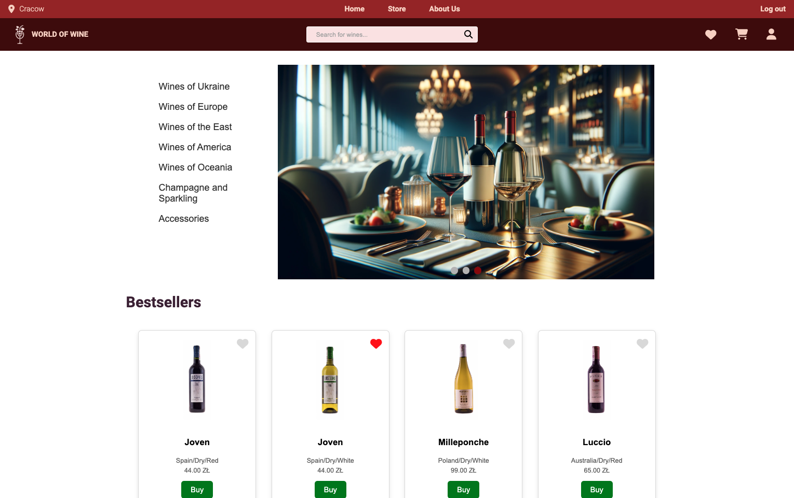

# Online Wine Store

This is a fully operational online store where you can buy wines, review and read about wines.

### Functionality

- Browse wines with details on taste, color, and origin.
- Find wines using filters and search function.
- Mark preferred wines as favorites for quick access.
- Rate and review wines
- Add wines to the cart

##### Admin Features:

- Add and edit wines
- Assign roles
- Monitor and track orders

## Required Dependencies

- npm
- python 3.10

## Installation

### Backend (Django)

1. Setup Django:

   ```bash
   cd server
   python3.10 -m venv venv
   ```

   ```bash
   source venv/bin/activate
   pip install -r requirements.txt
   ```

2. Perform migrations:

   ```bash
   python manage.py migrate
   ```

3. Create a superuser:

   ```bash
   python manage.py createsuperuser
   ```

4. Load data sets:

   ```bash
   python manage.py loaddata countries.json
   python manage.py loaddata tastes.json
   python manage.py loaddata colors.json
   python manage.py loaddata wines.json
   ```

5. Run the server:

   ```bash
   python manage.py runserver
   ```

### Frontend (React.js + Vite)

1. Install dependencies:

   ```bash
   cd client
   npm install
   ```

2. Run the frontend:

   ```bash
   npm run dev
   ```

Visit http://localhost:8000/admin, log in as a superuser, and navigate to the "Users" section. Select your superuser and set their role to "Manager" at the bottom. Optionally, you can create a regular user during this process.

## Usage

1. Open a web browser and go to [http://localhost:5173](http://localhost:5173) to see the frontend.
2. The Django admin panel will be available at [http://localhost:8000/admin](http://localhost:8000/admin).

## Screenshot


